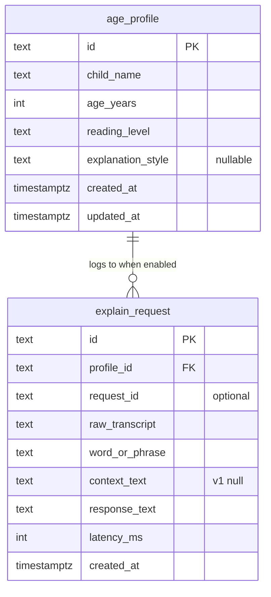

# Lexie Word Explainer — API catalog, entities, and data model (LX-1)

**Date:** 2026-04-22  
**Normative companion:** [lexie-word-explainer.SPEC.md](lexie-word-explainer.SPEC.md) (this document **details** APIs, schemas, and metadata; the SPEC remains the **contract** for edge cases and exit criteria).  
**PRD entity origin:** [../prds/lexie-word-explainer.PRD.md](../prds/lexie-word-explainer.PRD.md) **§5 — Entity shape**  
**Journeys + observability:** [lexie-word-explainer.journeys-and-observability.md](lexie-word-explainer.journeys-and-observability.md) — PRD **§4** mapped to routes and support signals  
**Runbook:** [lexie-word-explainer.RUNBOOK.md](lexie-word-explainer.RUNBOOK.md)  
**Budget & rollout:** [lexie-word-explainer.BUDGET-AND-ROLLOUT.md](lexie-word-explainer.BUDGET-AND-ROLLOUT.md)

---

## 1. Domain overview (single-tenant, one child)

| Concept | Role |
|--------|------|
| **`age_profile`** | The one editable **child profile** (PII) used in the LLM system message and user framing. **Exactly one** row is active for the deployment. |
| **`explain_request` (optional row)** | Append-only **diagnostic** log when `LEXIE_LOG_REQUESTS=1`. Not on the read path of `/explain` in v1. |
| **No separate “user” or “child account”** | Auth is **shared keys** (device, admin) in env, not per-user database records. |



*Figure: logical relationships. Storage types below use SQLite names.*

---

## 2. Entity: `age_profile`

### 2.1 Logical model (field dictionary)

| Field | Type (logical) | Required | PII | API (JSON) | Rule |
|-------|----------------|----------|-----|------------|------|
| `id` | UUID string **or** fixed integer | Yes | No | Omitted in `GET`/`PATCH` **or** exposed as read-only `id` — see §2.3 | Exactly **one** profile; implementation chooses PK style (§2.3). |
| `child_name` | string, 1…120 chars (recommended max) | Yes | **Yes** | `child_name` | Trim; reject empty on PATCH. |
| `age_years` | integer | Yes | Yes | `age_years` | Suggested valid range **4–12**; SPEC allows validation or soft clamp — document choice. |
| `reading_level` | string, 1…200 chars (recommended) | Yes | No | `reading_level` | Free text, e.g. “advanced for age”. |
| `explanation_style` | string or null | No | No | `explanation_style` | Hints for prompt; `null` = use defaults only. |
| `created_at` | timestamp (UTC) | Yes | No | Omitted in API **or** `created_at` ISO-8601 if exposed | Set on insert. |
| `updated_at` | timestamp (UTC) | Yes | No | Omitted in API **or** `updated_at` if exposed | Set on any PATCH. |

**API projection rule:** The SPEC shows the **core** child-editable fields. Implementations **MAY** add read-only `id`, `created_at`, `updated_at` to `GET`/`200 PATCH` for debugging; the **admin HTML** in §3.8 only needs the four editable fields.

### 2.2 `age_profile` — SQLite reference DDL (one row, Phase 1)

`id` as **TEXT** (UUID) matches the PRD’s UUID PK and keeps a stable FK for `explain_request`. Alternative: `INTEGER PRIMARY KEY` with a single row `id = 1` and `profile_id` integer FK — also valid; **choose one and keep migrations consistent**.

**Option A — UUID (aligned with PRD type names):**

```sql
-- Reference DDL; table/column names may be prefixed (e.g. app_*) if your ORM requires it.
CREATE TABLE age_profile (
  id            TEXT    PRIMARY KEY,  -- UUID v4 as hex string, single row
  child_name    TEXT    NOT NULL,
  age_years     INTEGER NOT NULL,
  reading_level TEXT    NOT NULL,
  explanation_style TEXT,
  created_at    TEXT    NOT NULL,  -- ISO-8601 UTC, SQLite-friendly
  updated_at    TEXT    NOT NULL
);

-- Optional: enforce single row in application code; or use a CHECK with a sentinel id.
CREATE INDEX IF NOT EXISTS idx_age_profile_one ON age_profile (id);
```

**Option B — single integer row (minimal):**

```sql
CREATE TABLE age_profile (
  id            INTEGER PRIMARY KEY CHECK (id = 1),
  child_name    TEXT    NOT NULL,
  age_years     INTEGER NOT NULL,
  reading_level TEXT    NOT NULL,
  explanation_style TEXT,
  created_at    TEXT    NOT NULL,
  updated_at    TEXT    NOT NULL
);
```

**Seed (either option):** insert one default row (e.g. `age_years=6`, `child_name='Child'`, `reading_level='grade-level'`) so `GET /profile` after admin auth is never “empty” before the parent edits (PRD first-run).

### 2.3 JSON Schemas (HTTP body)

**`GET /profile` 200 and `PATCH /profile` 200 body** (same object shape; timestamps optional extension):

```json
{
  "type": "object",
  "required": ["child_name", "age_years", "reading_level"],
  "properties": {
    "child_name": { "type": "string", "minLength": 1 },
    "age_years": { "type": "integer" },
    "reading_level": { "type": "string", "minLength": 1 },
    "explanation_style": { "type": ["string", "null"] }
  }
}
```

**`PATCH /profile` request (partial):** at least one of the four value fields; types as above. Empty strings for `child_name` / `reading_level` → `400` with a stable `error` key (implementation-defined message body; use `400` + JSON).

---

## 3. Entity: `explain_request` (opt-in log)

**Created only when** `LEXIE_LOG_REQUESTS=1`. When `0`, the application **MUST NOT** insert rows (per SPEC §7).

### 3.1 Field dictionary

| Field | Type | PRD / SPEC | Notes |
|-------|------|------------|--------|
| `id` | UUID TEXT PK | PRD | Unique per request. |
| `profile_id` | FK → `age_profile.id` | PRD | Always the single profile in Phase 1. |
| `request_id` | TEXT, nullable | SPEC `X-Request-Id` | If the server generated a request id, store it for correlation. |
| `raw_transcript` | TEXT | PRD + SPEC §4 | Full Whisper output. |
| `word_or_phrase` | TEXT | SPEC §4 | Truncation to 200 UTF-8 **code points** (spec says characters; use UTF-8–aware truncation in code). |
| `context_text` | TEXT, nullable | PRD, SPEC §4 | v1: **NULL** / omitted. |
| `response_text` | TEXT | PRD | The **text** sent to TTS (or joined explanation + headword, or a single JSON string — **document** in server README). **Default pattern (recommended):** insert a row only **after successful** TTS so this field is always non-empty. |
| `latency_ms` | INTEGER | PRD | Wall-clock from request start to TTS output ready. |
| `created_at` | TEXT (ISO UTC) | PRD | Server time. |

### 3.2 SQLite reference DDL

```sql
CREATE TABLE explain_request (
  id              TEXT    PRIMARY KEY,
  profile_id      TEXT    NOT NULL,
  request_id      TEXT,
  raw_transcript  TEXT    NOT NULL,
  word_or_phrase  TEXT    NOT NULL,
  context_text    TEXT,
  response_text   TEXT    NOT NULL,
  latency_ms      INTEGER NOT NULL,
  created_at      TEXT    NOT NULL,
  FOREIGN KEY (profile_id) REFERENCES age_profile(id)
);

CREATE INDEX IF NOT EXISTS idx_explain_request_created
  ON explain_request (created_at);
```

**Failed-request logging:** **Recommended v1 behavior:** do **not** insert `explain_request` rows on failure (keeps `NOT NULL` text fields and matches PRD “successful explain” audit). Optional future extension: relax schema or add a separate `explain_failure` table if analytics require it.

**Retention:** delete rows older than 30 days when logging is on (SPEC §7); implement as cron, startup sweep, or insert-trigger policy.

### 3.3 Internal LLM output (not persisted as a separate table, Phase 1)

**Chat completion JSON (when using structured output):** in-memory only unless folded into `response_text`:

| Key | When | Type |
|-----|------|------|
| `explanation_text` | always (if JSON path) | string |
| `headword` | `LEXIE_HEADWORD_TTS=1` | string |

This is **not** a REST entity; it is the **parsing target** of the model response before TTS.

---

## 4. Optional: usage rollup for `GET /admin/usage`

The SPEC does not require a table; options:

| Approach | Description |
|----------|-------------|
| **A. Query `explain_request`** | If logging was on for the month, `COUNT(*)` for `created_at` in month. If logging was off, return `null` or `0` with a disclaimer. |
| **B. `usage_counter` table** | `month_ym TEXT`, `explain_count INTEGER` — increment in memory + periodic flush, or on each success. |

Recommend **A** for simplicity when logs exist; otherwise **B** for ops visibility without PII in logs.

---

## 5. HTTP API catalog (Phase 1 + optional)

**Global conventions:** `UTF-8` JSON for errors; see **§6** for headers. Base path: `/` (no version prefix in v1).

| Method | Path | Auth | Request body | Success response | Notes |
|--------|------|------|-------------|------------------|--------|
| `GET` | `/health` | none | — | `200` JSON | §5.1 |
| `GET` | `/profile` | `Authorization: Bearer` admin | — | `200` JSON profile | §5.2 |
| `PATCH` | `/profile` | admin | JSON partial | `200` full profile | §5.2 |
| `POST` | `/explain` | device (prod) | `multipart/form-data` field `audio` | `200` `audio/mpeg` or `audio/wav` | §5.3 |
| `GET` | `/admin` | none (HTML shell) | — | `200` `text/html` | Token used only in JS to profile APIs |
| `GET` | `/admin/usage` | admin | — | `200` JSON | Optional |
| `GET` | `/admin/metrics` | admin | — | `200` JSON or `404` | Optional |

### 5.1 `GET /health`

| Item | Value |
|------|--------|
| **Response 200** | `Content-Type: application/json` |
| **Body (example)** | `{"ok": true, "version": "0.1.0", "git_sha": "abc123"}` — extra keys **allowed** for ops. |

### 5.2 `GET` / `PATCH /profile`

| Item | `GET` | `PATCH` |
|------|-------|--------|
| **Headers (success)** | `200`, optional `X-Request-Id` | same |
| **Errors** | `401` `{"error":"unauthorized"}` | `400`, `401`, `429` per SPEC |
| **PATCH body** | — | Partial JSON, keys: `age_years`, `reading_level`, `child_name`, `explanation_style` |

### 5.3 `POST /explain`

| Item | Detail |
|------|--------|
| **Success headers** | `Content-Type: audio/mpeg` (or wav); optional `X-Explain-Latency-Ms: <int>`; optional `X-Request-Id: <str>` |
| **Success body** | Raw bytes (not JSON) |
| **Error** | `Content-Type: application/json` with `{"error":"<code>`, optional `"max_seconds":30}` for `audio_too_long` |

**Standard `error` machine codes (union):**  
`unauthorized` · `audio_too_short` · `audio_too_long` · `transcription_empty` · `unintelligible_audio` · `payload_too_large` · `explanation_invalid` · `openai_unavailable` · `rate_limited` · `internal` — see SPEC §3.5, §5.1.

**Device key header (production):** prefer `Authorization: Bearer <LEXIE_DEVICE_KEY>`. The SPEC also allows `X-Device-Key: <value>`; document which the firmware uses.

### 5.4 `GET /admin` and static prototype

- **`GET /admin`:** `200` `text/html; charset=utf-8`. No `Authorization` on the initial request.
- **Prototype** (`/prototype/` or static mount): not JSON APIs; `GET` returns `text/html` + static assets. See SPEC §6 (CORS).

---

## 6. Cross-cutting metadata (headers, IDs, versioning)

| Name | Direction | Required | Purpose |
|------|-----------|----------|--------|
| `X-Request-Id` | Response (all routes **may** emit) | No | Correlates access logs, optional `explain_request.request_id`, support. Use UUID. |
| `X-Explain-Latency-Ms` | `POST /explain` response | No | End-to-end milliseconds for ops / SLO sampling. |
| `Server` / `Via` | Response | No | **Avoid** leaking internal stack; optional generic `Server: Lexie`. |
| **Version in JSON** | `GET /health` | Recommended | `version` + optional `git_sha` for “what is deployed?”. |
| **Profile revision** | Not required in v1 | — | If needed later, `ETag` on `GET /profile` or `updated_at` in body supports optimistic locking. |

**Request metadata (inbound, optional):** clients may send `X-Request-Id` (or `Traceparent`); the server **may** echo the same id in the response for distributed tracing. Not required for Phase 1.

---

## 7. CORS and credentials (reminder)

- Browsers calling `/explain` or admin `fetch` with `Authorization: Bearer` need explicit `allow_origins` (SPEC §2, §6). **Do not** use `Access-Control-Allow-Origin: *` with credentials.  
- **Preflight:** `POST /explain` with `multipart` + custom headers triggers OPTIONS; CORS config must allow `POST`, `Authorization`, and `Content-Type` (multipart).  

---

## 8. Changelog of doc vs PRD

| Topic | PRD | This doc + SPEC |
|-------|-----|-----------------|
| `age_profile.id` UUID | Stated in PRD | **Option** integer singleton allowed for SQLite simplicity (§2.2). |
| `explain_request` always on | Implied in PRD entity | **Gated** by `LEXIE_LOG_REQUESTS=1` (SPEC + privacy default). |
| `response_text` when error | — | **Optional** failure rows with `error_code` (§3.2). |

---

*End of document.*
